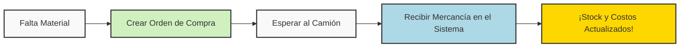

# 📦 Manual de Usuario: Módulo de Inventario y Compras

¡Hola! Bienvenido al **Módulo de Inventario y Compras**. 

Sabemos que administrar el inventario puede parecer complicado, pero hemos diseñado esta herramienta para que sea tan fácil como organizar la despensa de tu propia casa. En este manual te llevaremos de la mano para que aprendas a usar cada sección del sistema sin complicaciones.

---

## 🌟 1. Conceptos Básicos (Para empezar con buen pie)

Antes de presionar botones, vamos a ponernos de acuerdo en tres palabras que verás todo el tiempo:

* **Bodega / Almacén:** Es el lugar físico donde guardas las cosas. Piensa que tu empresa es una casa; una bodega podría ser "La Cocina" y otra bodega podría ser "El Garaje".
* **Artículo:** Es cualquier cosa que compras para usar o vender (tornillos, perfiles de aluminio, cristales, silicón). 
* **Orden de Compra:** Es simplemente la **lista de compras** formal que le mandas a quien te vende (tu proveedor). Es la promesa de que vas a comprar algo.

---

## 📊 2. El Dashboard (Tu Panel de Control)

El **Dashboard** es la primera pantalla que ves. Es como el tablero del velocímetro de tu carro: te dice exactamente cómo está la salud de tus materiales de un solo vistazo.

### ¿Qué significan las tarjetas de colores arriba?
* 📦 **Total Artículos:** Cuántos tipos de productos diferentes tienes registrados en todo el sistema.
* ⚠️ **Bajo Stock:** Te avisa cuántos productos se están agotando. ¡Si ves un número alto aquí, es hora de ir de compras!
* 💵 **Valor Inventario:** Si sumas el costo de absolutamente todo lo que tienes guardado en todas tus bodegas, esto es lo que vale en dinero real.

### La Tabla de Control de Stock
Debajo de las tarjetas, verás una lista larga. Esta lista te muestra cada artículo, dónde está guardado (en qué bodega) y **cuántas unidades te quedan**. 
* Puedes escribir en el recuadro de **Buscar** para encontrar rápidamente si te quedan "Tornillos de 2 pulgadas".
* Si ves una cajita de color rojo que dice "Bajo", significa que deberías comprar más de ese artículo pronto.

---

## 📝 3. Las Órdenes de Compra (Cómo pedir material)

Aquí es donde sucede la magia cuando necesitas comprar cosas nuevas para tu negocio.

### ¿Cómo crear una Orden de Compra nueva?
1. Ve a la sección de **Órdenes de Compra** en el menú de la izquierda.
2. Haz clic en el botón verde grande que dice **"+ Nueva Orden"**.
3. **Elige el Proveedor:** ¿A quién le vas a comprar? (Ej. Ferretería El Sol).
4. **Bodega Destino:** ¿En cuál de tus almacenes se van a guardar estas cosas cuando lleguen?
5. **Agrega los artículos:** Busca lo que quieres pedir, pon la cantidad y el precio que te están cobrando.
6. Dale a **Guardar**. ¡Listo! Ya creaste tu lista de compras formal (su estado será "Pendiente").

---

## 🚚 4. Recibir Mercancía (¡Llegó el camión!)

Crear la Orden de Compra no suma los artículos mágicamente a tu bodega. El sistema es inteligente y sabe que a veces los proveedores se tardan o te entregan las cosas por partes. Por eso, debes decirle al sistema cuando la mercancía **físicamente llegó por la puerta**.

### Pasos para recibir:
1. En la lista de Órdenes de Compra, busca tu orden pendiente.
2. Haz clic en el botón azul **"Recibir Mercancía"**.
3. Se abrirá una ventana. Aquí el sistema te dice: *"Me pediste 100 tornillos, ¿cuántos te acaban de llegar en este momento?"*.
4. Si te llegaron los 100 completos, deja el número en 100. Si solo te trajeron 50, escribe 50. 
5. Asegúrate de que la **Bodega Destino** sea la correcta (el sistema te sugerirá la que elegiste al principio).
6. Haz clic en **Guardar Recepción**.

> **⚠️ MAGIA AUTOMÁTICA:** Cuando haces clic en Guardar Recepción, el sistema hace dos cosas por ti al instante:
> 1. Suma las cantidades directamente a la bodega que elegiste.
> 2. **Actualiza el costo del artículo** usando el precio de tu factura, para que siempre sepas cuánto te están costando las cosas en la vida real.

### Gráfico: El ciclo de la compra

---

## 🕵️‍♂️ 5. El Kardex (El historial médico de tus artículos)

Imagina que jurabas que tenías 20 cristales, vas a la bodega y solo hay 5. ¿Qué pasó? ¿Quién los sacó? ¿Cuándo? Para resolver estos misterios existe el **Kardex**.

El Kardex es un registro imborrable de todos los movimientos de tu empresa.

### ¿Cómo investigar un artículo?
1. Ve al menú **Kardex**.
2. Arriba, elige la **Bodega** y luego selecciona el **Artículo** que quieres investigar (Ej: Cristal de 4mm).
3. Selecciona desde qué fecha quieres ver la historia y haz clic en la lupa.

Verás una tabla que te cuenta una historia de arriba hacia abajo (del movimiento más reciente al más antiguo):
* **Entradas (Color Verde):** Cuando el producto entró a la bodega (Casi siempre por una Orden de Compra). Suma a tu inventario.
* **Salidas (Color Rojo):** Cuando el producto salió (porque se usó para fabricar algo o se dañó). Resta a tu inventario.
* **Balance:** Te dice exactamente cuánto tenías en la mano justo en el momento de ese movimiento.

---

## 🏠 6. Bodegas y Proveedores (Los Archivos Básicos)

Finalmente, para que todo el sistema funcione, necesitas tener registrados tus lugares y tus contactos.

* **Bodegas:** Aquí puedes crear nuevas ubicaciones. Si un día alquilas un local nuevo para guardar mercancía, vienes aquí, le das a "Nueva Bodega" y le pones nombre.
* **Proveedores:** Es tu agenda de contactos de las empresas que te venden. Tenerlos registrados te permite seleccionarlos rápidamente cuando vayas a crearles una Orden de Compra.

---

### 🎉 ¡Felicidades!
Con esto ya tienes el conocimiento necesario para manejar el inventario como todo un profesional. Recuerda: el secreto de un buen inventario es **siempre registrar en el sistema lo que pasa en la vida real.** Si algo entra por la puerta física, debe entrar por el sistema. ¡Mucho éxito!
