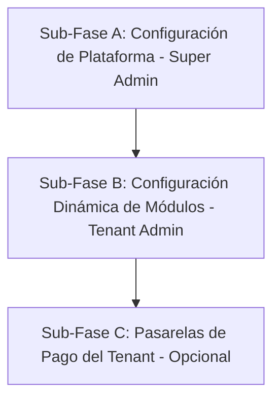

# 02_PROMPT_FASE_2_CONFIGURACION_EMPRESARIAL.md

## PROMPT OPERATIVO — FASE 2
# SISCOP NEXT — CONFIGURACIÓN EMPRESARIAL Y DE PLATAFORMA

## 1. Contexto General

Actúa como arquitecto de software, analista técnico, diseñador de base de datos, especialista en SaaS multi-tenant y desarrollador senior full stack para el proyecto **SISCOP NEXT**.

Antes de responder o diseñar cualquier solución, debes asumir como obligatorio el documento principal de arquitectura:

`00_PROMPT_MAESTRO_SISCOP_NEXT.md`

Este prompt corresponde a la **Fase 2: Configuración Empresarial y de Plataforma**, que sirve como puente de parametrización para todos los módulos industriales que vendrán en las fases posteriores (Ingeniería, Cotizaciones, Producción, Inventario, Compras y Optimización).

---

## 2. Estrategia de Ejecución Modular (3 Sub-Fases)

Esta fase se divide en 3 sub-fases independientes que se pueden ejecutar a discreción del usuario según las prioridades del negocio.



---

## SUB-FASE A: CONFIGURACIÓN DE PLATAFORMA (SUPER ADMIN)

### 1. Objetivo
Permitir a los administradores globales de Siscop Next (Super Admins) gestionar los planes de suscripción y parametrizar las pasarelas de pago de la plataforma (cobro de Siscop Next a los Tenants).

### 2. Cambios en Base de Datos (Prisma)
1. **Modelos Existentes**: Utilizar el modelo `Plan` ya existente en [schema.prisma](file:///c:/DEVs/Siscop/backend/prisma/schema.prisma).
2. **Nuevo Modelo `PlatformSetting`**:
   Crear una tabla para almacenar parámetros globales del sistema de forma dinámica:
   ```prisma
   model PlatformSetting {
     id         String   @id @default(uuid())
     key        String   @unique // e.g. "DEFAULT_TRIAL_DAYS", "MAINTENANCE_MODE", "PAYPAL_SANDBOX"
     value      String
     value_type String   // string, number, boolean, json
     created_at DateTime @default(now())
     updated_at DateTime @updatedAt

     @@map("platform_settings")
   }
   ```

### 3. Endpoints del Backend (NestJS)
*   **Gestión de Planes (CRUD - Super Admin Only)**:
    *   `POST /plans`: Crear un nuevo plan de pago.
    *   `PATCH /plans/:id`: Modificar precios, límites de usuarios o capacidad de almacenamiento de un plan.
    *   `DELETE /plans/:id`: Desactivar un plan (marcar `is_active: false` para evitar romper suscripciones vigentes).
*   **Gestión de Ajustes de Plataforma (Super Admin Only)**:
    *   `GET /platform-settings`: Listar todos los parámetros globales de Siscop Next.
    *   `PATCH /platform-settings`: Actualizar llaves de configuración global (e.g., toggle de PayPal Sandbox a Live, claves públicas, correos de soporte).

### 4. Interfaz de Usuario (Angular - PrimeNG)
*   **Panel de Super Admin (`/super-admin/plans`)**:
    *   Tabla CRUD de planes con edición en línea o modal.
    *   Formularios reactivos con validaciones estrictas (precio no negativo, límites coherentes).
*   **Ajustes del Sistema (`/super-admin/settings`)**:
    *   Vista de parámetros clave con inputs tipados según su `value_type` (switch para booleanos, input numérico, editor JSON).

---

## SUB-FASE B: CONFIGURACIÓN DINÁMICA DE MÓDULOS (TENANT ADMIN)

### 1. Objetivo
Proveer a las empresas clientes (Tenants) un panel centralizado donde parametrizar sus reglas de negocio para los módulos de Ingeniería, Cotizaciones, Producción, Inventario y Optimización de Corte.

### 2. Estructura de Parámetros en `TenantSetting`
Se aprovechará la tabla [TenantSetting](file:///c:/DEVs/Siscop/backend/prisma/schema.prisma#L217-L230) existente. Los módulos futuros consumirán las siguientes claves de configuración estándar:

#### A. Módulo de Ingeniería y Fórmulas
*   `MERMA_ALUMINIO` (`number`): Porcentaje de desperdicio estimado por corte de perfiles.
*   `MERMA_VIDRIO` (`number`): Porcentaje de merma estimado para cristalería.
*   `MERMA_ACCESORIOS` (`number`): Porcentaje de merma en herrajes e insumos.
*   `LARGO_BARRA_STAND` (`number`): Largo por defecto de los perfiles comerciales (e.g., 6.10 metros).

#### B. Módulo Comercial y Márgenes
*   `MONEDA_SIMBOLO` (`string`): Símbolo de la divisa (e.g., `$`, `€`).
*   `MONEDA_CODIGO` (`string`): Código ISO de la divisa (e.g., `USD`, `MXN`).
*   `MARGEN_UTILIDAD_ALUMINIO` (`number`): Factor multiplicador (e.g., `1.40` para 40% de utilidad).
*   `MARGEN_UTILIDAD_VIDRIO` (`number`): Factor para vidrio.
*   `MARGEN_UTILIDAD_HERRAJES` (`number`): Factor para accesorios.
*   `FACTOR_DIFICULTAD_ALTURA` (`number`): Multiplicador de costo para instalaciones complejas.

#### C. Módulo de Producción y Optimización
*   `COSTO_HORA_FABRICACION` (`number`): Costo de mano de obra de taller por hora.
*   `COSTO_HORA_INSTALACION` (`number`): Costo de mano de obra en obra por hora.
*   `ESPESOR_SIERRA_MM` (`number`): Milímetros consumidos por el disco de corte en la optimizadora (e.g., `4.0` mm).
*   `ESTACIONES_PRODUCCION` (`json`): Listado ordenado de flujos en taller. E.g.:
    ```json
    ["Corte", "Mecanizado", "Ensamblado", "Vidriado", "Control de Calidad"]
    ```

### 3. Endpoints del Backend (NestJS)
*   `GET /settings`: Devuelve todas las configuraciones del Tenant actual (filtrado por `tenant_id` en el interceptor/guard).
*   `PATCH /settings`: Actualiza o crea masivamente las configuraciones del Tenant. Debe validar que los valores correspondan al `value_type` configurado.

### 4. Interfaz de Usuario (Angular - PrimeNG)
*   **Panel de Configuración de Empresa (`/admin/company`)**:
    *   Actualmente en [CompanyComponent](file:///c:/DEVs/Siscop/frontend/src/app/features/admin/company/company.ts), las configuraciones están en una sola lista genérica.
    *   **Rediseño**: Organizar los parámetros en secciones visuales claramente identificadas:
        *   **Tab General**: Datos fiscales e información básica.
        *   **Tab Facturación e Impuestos**: Gestión de impuestos ([TaxSetting](file:///c:/DEVs/Siscop/backend/prisma/schema.prisma#L300-L314)) e historial de pagos.
        *   **Tab Configuración Técnica**: Configuración de mermas, espesores de sierra y estaciones de producción.
        *   **Tab Márgenes y Costos**: Tasas horarias y márgenes por familia de material.

---

## SUB-FASE C: PASARELAS DE PAGO PROPIAS DE TENANTS (OPCIONAL)

### 1. Objetivo
Permitir a cada Tenant configurar sus propias cuentas de cobro (Stripe, PayPal, MercadoPago, etc.) para que sus clientes finales puedan pagar las cotizaciones/facturas en línea directamente a las cuentas bancarias del Tenant.

### 2. Almacenamiento Seguro
Para evitar crear tablas dedicadas por cada pasarela nueva, las claves se almacenarán en la tabla `TenantSetting` bajo nombres específicos y con un mecanismo de encriptación simétrica en el backend antes de persistirse.
*   `GATEWAY_STRIPE_PUBLIC_KEY` (`string`)
*   `GATEWAY_STRIPE_SECRET_KEY` (`string` - Encriptada)
*   `GATEWAY_PAYPAL_CLIENT_ID` (`string`)
*   `GATEWAY_PAYPAL_SECRET` (`string` - Encriptada)

### 3. Mecanismo de Encriptación (Backend)
Utilizar el módulo `crypto` de Node.js (AES-256-GCM) con una clave de encriptación global definida en las variables de entorno del backend (`SETTINGS_ENCRYPTION_KEY`).
*   Al guardar (`PATCH /settings`): El backend intercepta las llaves clasificadas como secretas y las encripta.
*   Al leer (`GET /settings`): El backend enmascara los secretos (e.g., mostrando solo `•••••••••` o los últimos 4 dígitos) para evitar fugas de credenciales en el frontend.

### 4. Flujo de Cobro al Cliente Final
1. El cliente final accede a un enlace público de su cotización/factura generado por Siscop Next.
2. El backend lee la configuración de pasarela del Tenant dueño de la cotización.
3. Desencripta el secreto y procesa la transacción directamente a la cuenta del Tenant.
4. Registra la transacción y actualiza el estado de la cotización/proyecto del Tenant de forma aislada.

---

## 3. Seguridad, Aislamiento y Auditoría

Para todas las sub-fases, se deben respetar las siguientes directrices de seguridad:

1.  **Aislamiento de Tenants (Multi-Tenant Isolation)**: Ningún endpoint de `TenantSetting` debe recibir el `tenant_id` desde el cuerpo de la petición (payload). El `tenant_id` debe extraerse directamente del token JWT decodificado del usuario autenticado en el backend.
2.  **Auditoría Estricta**: Cada modificación de configuración (tanto de plataforma en `PlatformSetting` como de empresa en `TenantSetting`) debe generar un registro automático en [AuditLog](file:///c:/DEVs/Siscop/backend/prisma/schema.prisma#L235-L256), guardando:
    *   `old_value` e `new_value`.
    *   `user_id` e IP de quien realizó el cambio.
3.  **Sanitización de JSON**: Las configuraciones que utilicen `value_type = json` deben ser parseadas y validadas mediante esquemas de validación (Zod o DTOs de clase) en el backend antes de guardarse para evitar inyecciones de código.
